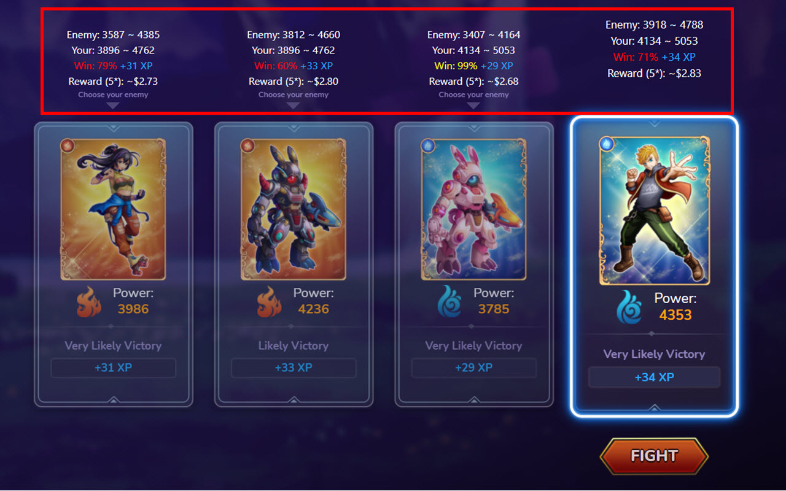

# Bunicorn Battle Assistant
BUNI Battle Assistant is a Chrome extension for help BUNI gamer to easily and quickly calculate the battle point from selected Trainer and Bunicorn.

The calculation is automatically follow the game guide as https://docs.bunicorn.game/battle/fighting/calculating-player-power

Just select your favourite Trainer and Bunicoin and the extension will automatically read from your battle screen all the attributes, elements and do calculation. The result will inject into the each Enemy screen so you can easily pick your most easiest or most profit enemy by your strategy.

Enjoy and have fun with the game!

# How to install:
- Extract above archive into your persistent drive (Try not to put in Desktop or Downloads folder)
- In Chrome, go to Menu > More tools > Extensions
- Toggle on the "Developer mode"
- Click "Load unpacked" then select the folder that you extracted the package.

On the Battle screen of Bunicorn game, after select Trainer and Bunicoin, click to any space on the screen 
Enjoy the game!

# Disclaimer:
- This extension is using HTML manipulation to read the Bunicorn Battle information, so it is not always accurate. Use it as your own risk.
- The information provided by this extension are mainly for your reference only. You're response for your own choice in the battle.

# Contact:
Facebook: [truckyand](https://www.facebook.com/anhlongcongtu)
If you find this extension is useful, buy me a beer at **0xCad931D86bDB16E8d6e252F995F6904d4F416147**

Formula referenced from [harrytrinh](https://t.me/harrytrinh)
